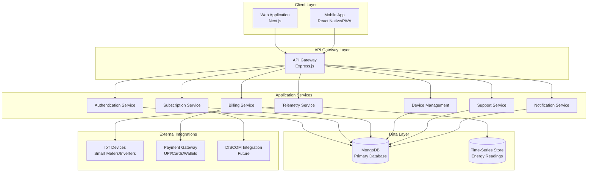
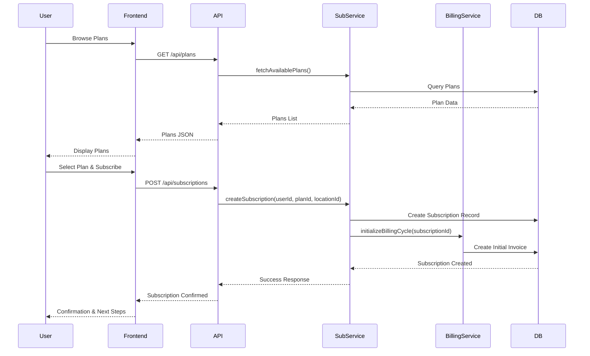
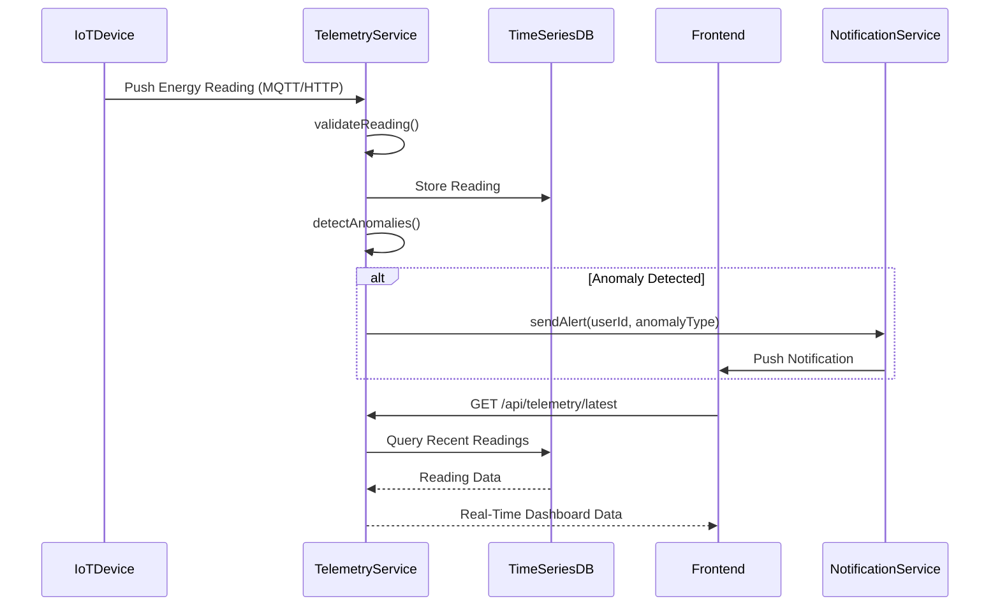
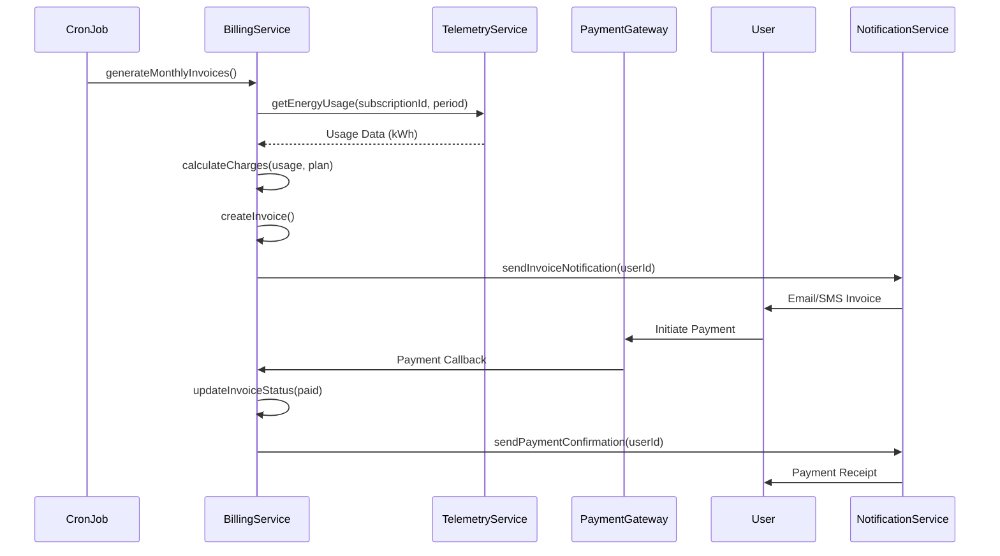

# Design Document: Energy-as-a-Service (EaaS) Digital Platform

## Overview

The Energy-as-a-Service (EaaS) Digital Platform enables end consumers to subscribe to energy services (solar power, battery backup, lighting, cooling, uptime guarantees) without owning or maintaining infrastructure. The platform provides a scalable, user-friendly digital experience with real-time monitoring, transparent billing, IoT integration, and support management. It is designed to handle millions of users and devices while maintaining 99%+ uptime and enabling future integration with DISCOM workflows for net-metering, billing synchronization, and load management.

The platform architecture follows a microservices-inspired modular design with a Next.js frontend, Express.js backend API, MongoDB database for persistence, and IoT device integration layer for real-time telemetry. The system supports three user roles (consumer, enterprise, admin) with role-based access control, subscription lifecycle management, real-time energy tracking dashboards, automated billing with payment gateway integration, and a comprehensive support ticketing system.

## Architecture



## Main Workflows

### Subscription Workflow



### Real-Time Energy Monitoring Workflow



### Billing & Payment Workflow



## Components and Interfaces

### Component 1: Authentication Service

**Purpose**: Manages user authentication, authorization, session management, and role-based access control.

**Interface**:
```pascal
INTERFACE AuthenticationService
  PROCEDURE register(userData: UserRegistrationData): AuthResult
  PROCEDURE login(credentials: LoginCredentials): AuthResult
  PROCEDURE logout(sessionToken: String): Boolean
  PROCEDURE validateToken(token: String): TokenValidationResult
  PROCEDURE refreshToken(refreshToken: String): AuthResult
  PROCEDURE resetPassword(email: String): Boolean
END INTERFACE
```

**Responsibilities**:
- User registration with email verification
- Secure login with JWT token generation
- Session management and token refresh
- Role-based access control (consumer, enterprise, admin)
- Password reset and account recovery

### Component 2: Subscription Service

**Purpose**: Manages the complete subscription lifecycle including plan selection, activation, modification, and cancellation.

**Interface**:
```pascal
INTERFACE SubscriptionService
  PROCEDURE createSubscription(userId: UUID, planId: UUID, locationId: UUID): Subscription
  PROCEDURE getSubscription(subscriptionId: UUID): Subscription
  PROCEDURE updateSubscription(subscriptionId: UUID, updates: SubscriptionUpdate): Subscription
  PROCEDURE cancelSubscription(subscriptionId: UUID, reason: String): Boolean
  PROCEDURE pauseSubscription(subscriptionId: UUID): Boolean
  PROCEDURE resumeSubscription(subscriptionId: UUID): Boolean
  PROCEDURE getActiveSubscriptions(userId: UUID): List<Subscription>
END INTERFACE
```

**Responsibilities**:
- Subscription creation and validation
- Plan upgrade/downgrade management
- Subscription status tracking (active, paused, cancelled)
- Billing cycle management (monthly, yearly)
- Location-based subscription assignment

### Component 3: Billing Service

**Purpose**: Handles invoice generation, payment processing, and financial reporting.

**Interface**:
```pascal
INTERFACE BillingService
  PROCEDURE generateInvoice(subscriptionId: UUID, billingPeriod: DateRange): Invoice
  PROCEDURE calculateCharges(usage: EnergyUsage, plan: EnergyPlan): ChargeBreakdown
  PROCEDURE processPayment(invoiceId: UUID, paymentMethod: PaymentMethod): PaymentResult
  PROCEDURE getInvoiceHistory(userId: UUID): List<Invoice>
  PROCEDURE sendPaymentReminder(invoiceId: UUID): Boolean
  PROCEDURE applyDiscount(invoiceId: UUID, discountCode: String): Invoice
END INTERFACE
```

**Responsibilities**:
- Monthly/yearly invoice generation based on energy usage
- Tax calculation and compliance
- Payment gateway integration (UPI, cards, net banking, wallets)
- Payment status tracking and reconciliation
- Overdue payment management and reminders

### Component 4: Device Management Service

**Purpose**: Manages IoT device registration, monitoring, and lifecycle.

**Interface**:
```pascal
INTERFACE DeviceManagementService
  PROCEDURE registerDevice(deviceData: DeviceRegistration): Device
  PROCEDURE assignDeviceToLocation(deviceId: UUID, locationId: UUID): Boolean
  PROCEDURE getDeviceStatus(deviceId: UUID): DeviceStatus
  PROCEDURE updateDeviceStatus(deviceId: UUID, status: String): Boolean
  PROCEDURE getLocationDevices(locationId: UUID): List<Device>
  PROCEDURE decommissionDevice(deviceId: UUID): Boolean
END INTERFACE
```

**Responsibilities**:
- Device registration and provisioning
- Device-to-location assignment
- Device health monitoring
- Firmware update management
- Device decommissioning

### Component 5: Telemetry Service

**Purpose**: Collects, processes, and stores real-time energy data from IoT devices.

**Interface**:
```pascal
INTERFACE TelemetryService
  PROCEDURE ingestReading(deviceId: UUID, reading: EnergyReading): Boolean
  PROCEDURE getLatestReading(deviceId: UUID): EnergyReading
  PROCEDURE getReadingHistory(deviceId: UUID, timeRange: DateRange): List<EnergyReading>
  PROCEDURE calculateUsage(locationId: UUID, period: DateRange): EnergyUsage
  PROCEDURE detectAnomalies(deviceId: UUID): List<Anomaly>
  PROCEDURE generateForecast(locationId: UUID, horizon: Integer): EnergyForecast
END INTERFACE
```

**Responsibilities**:
- Real-time data ingestion from smart meters and inverters
- Time-series data storage and retrieval
- Energy usage calculation and aggregation
- Anomaly detection (unusual consumption, device failures)
- Energy forecasting and predictive analytics

### Component 6: Support Service

**Purpose**: Manages customer support tickets, issue tracking, and resolution workflows.

**Interface**:
```pascal
INTERFACE SupportService
  PROCEDURE createTicket(userId: UUID, issue: IssueData): SupportTicket
  PROCEDURE getTicket(ticketId: UUID): SupportTicket
  PROCEDURE updateTicketStatus(ticketId: UUID, status: String): SupportTicket
  PROCEDURE assignTicket(ticketId: UUID, agentId: UUID): Boolean
  PROCEDURE addComment(ticketId: UUID, comment: String, authorId: UUID): Boolean
  PROCEDURE getUserTickets(userId: UUID): List<SupportTicket>
  PROCEDURE escalateTicket(ticketId: UUID): Boolean
END INTERFACE
```

**Responsibilities**:
- Ticket creation and categorization
- Priority-based ticket routing
- Agent assignment and workload balancing
- SLA tracking and escalation
- Customer communication and updates

### Component 7: Notification Service

**Purpose**: Delivers multi-channel notifications (email, SMS, push, in-app) to users.

**Interface**:
```pascal
INTERFACE NotificationService
  PROCEDURE sendNotification(userId: UUID, notification: NotificationData): Boolean
  PROCEDURE sendBulkNotifications(userIds: List<UUID>, notification: NotificationData): Boolean
  PROCEDURE getUserNotifications(userId: UUID): List<Notification>
  PROCEDURE markAsRead(notificationId: UUID): Boolean
  PROCEDURE updatePreferences(userId: UUID, preferences: NotificationPreferences): Boolean
END INTERFACE
```

**Responsibilities**:
- Multi-channel notification delivery (email, SMS, push, in-app)
- Notification templating and personalization
- User preference management
- Delivery status tracking
- Alert prioritization (critical, warning, info)

## Data Models

### Model 1: User

```pascal
STRUCTURE User
  id: UUID
  name: String
  email: String
  password_hash: String
  phone: String
  role: Enum['admin', 'consumer', 'enterprise']
  organization_id: UUID (nullable)
  status: Enum['active', 'suspended', 'pending']
  created_at: DateTime
  updated_at: DateTime
END STRUCTURE
```

**Validation Rules**:
- Email must be unique and valid format
- Password must be at least 8 characters with complexity requirements
- Phone must be valid format (optional)
- Role must be one of: admin, consumer, enterprise
- Status defaults to 'active'

### Model 2: Subscription

```pascal
STRUCTURE Subscription
  id: UUID
  user_id: UUID (foreign key to User)
  plan_id: UUID (foreign key to EnergyPlan)
  location_id: UUID (foreign key to Location)
  status: Enum['active', 'paused', 'cancelled']
  billing_cycle: Enum['monthly', 'yearly']
  start_date: DateTime
  end_date: DateTime (nullable)
  created_at: DateTime
  updated_at: DateTime
END STRUCTURE
```

**Validation Rules**:
- user_id, plan_id, location_id must reference valid records
- start_date cannot be in the past
- end_date must be after start_date (if provided)
- Status defaults to 'active'
- Billing cycle defaults to 'monthly'

### Model 3: EnergyPlan

```pascal
STRUCTURE EnergyPlan
  id: UUID
  name: String
  description: String
  plan_type: Enum['solar', 'battery', 'hybrid', 'grid_backup']
  capacity_kw: Decimal
  monthly_fee: Decimal
  per_kwh_rate: Decimal
  features: List<String>
  is_active: Boolean
  created_at: DateTime
  updated_at: DateTime
END STRUCTURE
```

**Validation Rules**:
- name must be unique
- capacity_kw must be positive
- monthly_fee and per_kwh_rate must be non-negative
- plan_type must be valid enum value
- is_active defaults to true

### Model 4: Device

```pascal
STRUCTURE Device
  id: UUID
  device_serial: String (unique)
  location_id: UUID (foreign key to Location)
  device_type: Enum['smart_meter', 'solar_inverter', 'battery_system']
  status: Enum['online', 'offline', 'error']
  firmware_version: String
  installed_at: DateTime
  last_seen: DateTime
  created_at: DateTime
  updated_at: DateTime
END STRUCTURE
```

**Validation Rules**:
- device_serial must be unique
- location_id must reference valid location
- device_type must be valid enum value
- Status defaults to 'online'
- last_seen updated on every telemetry push

### Model 5: EnergyReading

```pascal
STRUCTURE EnergyReading
  id: UUID
  device_id: UUID (foreign key to Device)
  timestamp: DateTime
  energy_generated_kwh: Decimal
  energy_consumed_kwh: Decimal
  grid_usage_kwh: Decimal
  battery_soc: Integer (0-100)
  voltage: Decimal
  current: Decimal
  power_factor: Decimal
  created_at: DateTime
END STRUCTURE
```

**Validation Rules**:
- device_id must reference valid device
- timestamp must be valid and not in future
- All energy values must be non-negative
- battery_soc must be between 0 and 100
- voltage, current, power_factor must be within acceptable ranges

### Model 6: Invoice

```pascal
STRUCTURE Invoice
  id: UUID
  subscription_id: UUID (foreign key to Subscription)
  billing_period: String (e.g., "Feb 2026")
  billing_period_start: DateTime
  billing_period_end: DateTime
  due_date: DateTime
  energy_used_kwh: Decimal
  base_amount: Decimal
  tax: Decimal
  discount: Decimal
  total_amount: Decimal
  status: Enum['pending', 'paid', 'overdue', 'cancelled']
  payment_id: UUID (nullable)
  created_at: DateTime
  updated_at: DateTime
END STRUCTURE
```

**Validation Rules**:
- subscription_id must reference valid subscription
- billing_period_end must be after billing_period_start
- due_date must be after billing_period_end
- All monetary values must be non-negative
- total_amount = base_amount + tax - discount
- Status defaults to 'pending'

### Model 7: SupportTicket

```pascal
STRUCTURE SupportTicket
  id: UUID
  user_id: UUID (foreign key to User)
  subject: String
  description: String
  category: Enum['billing', 'technical', 'device', 'account', 'other']
  priority: Enum['low', 'medium', 'high', 'critical']
  status: Enum['open', 'in_progress', 'resolved', 'closed']
  assigned_to: UUID (nullable, foreign key to User)
  resolution: String (nullable)
  created_at: DateTime
  updated_at: DateTime
  resolved_at: DateTime (nullable)
END STRUCTURE
```

**Validation Rules**:
- user_id must reference valid user
- subject and description are required
- category and priority must be valid enum values
- Status defaults to 'open'
- Priority defaults to 'medium'
- resolved_at set when status changes to 'resolved'

### Model 8: Location

```pascal
STRUCTURE Location
  id: UUID
  user_id: UUID (foreign key to User)
  address_line1: String
  address_line2: String (nullable)
  city: String
  state: String
  postal_code: String
  country: String
  latitude: Decimal
  longitude: Decimal
  location_type: Enum['residential', 'commercial', 'industrial']
  created_at: DateTime
  updated_at: DateTime
END STRUCTURE
```

**Validation Rules**:
- user_id must reference valid user
- address_line1, city, state, postal_code, country are required
- latitude must be between -90 and 90
- longitude must be between -180 and 180
- location_type must be valid enum value

## Algorithmic Pseudocode

### Main Processing Algorithm: Subscription Creation

```pascal
ALGORITHM createSubscription(userId, planId, locationId)
INPUT: userId of type UUID, planId of type UUID, locationId of type UUID
OUTPUT: subscription of type Subscription

BEGIN
  // Precondition checks
  ASSERT userId IS NOT NULL
  ASSERT planId IS NOT NULL
  ASSERT locationId IS NOT NULL
  
  // Step 1: Validate user exists and is active
  user ← database.findUserById(userId)
  IF user IS NULL OR user.status ≠ 'active' THEN
    THROW Error("Invalid or inactive user")
  END IF
  
  // Step 2: Validate plan exists and is active
  plan ← database.findPlanById(planId)
  IF plan IS NULL OR plan.is_active ≠ true THEN
    THROW Error("Invalid or inactive plan")
  END IF
  
  // Step 3: Validate location exists and belongs to user
  location ← database.findLocationById(locationId)
  IF location IS NULL OR location.user_id ≠ userId THEN
    THROW Error("Invalid location or access denied")
  END IF
  
  // Step 4: Check for existing active subscription at location
  existingSubscription ← database.findActiveSubscription(locationId)
  IF existingSubscription IS NOT NULL THEN
    THROW Error("Active subscription already exists at this location")
  END IF
  
  // Step 5: Create subscription record
  subscription ← NEW Subscription
  subscription.id ← generateUUID()
  subscription.user_id ← userId
  subscription.plan_id ← planId
  subscription.location_id ← locationId
  subscription.status ← 'active'
  subscription.billing_cycle ← 'monthly'
  subscription.start_date ← currentDateTime()
  subscription.end_date ← NULL
  
  // Step 6: Persist subscription
  database.saveSubscription(subscription)
  
  // Step 7: Initialize billing cycle
  initializeBillingCycle(subscription.id)
  
  // Step 8: Send confirmation notification
  notificationService.sendNotification(userId, {
    type: 'subscription_created',
    subscriptionId: subscription.id
  })
  
  ASSERT subscription.id IS NOT NULL
  ASSERT subscription.status = 'active'
  
  RETURN subscription
END
```

**Preconditions**:
- userId, planId, locationId are valid UUIDs
- Database connection is established
- User has permission to create subscriptions

**Postconditions**:
- Subscription record created in database
- Billing cycle initialized
- Notification sent to user
- Returns valid Subscription object with status 'active'

**Loop Invariants**: N/A (no loops in this algorithm)

### Telemetry Ingestion Algorithm

```pascal
ALGORITHM ingestEnergyReading(deviceId, readingData)
INPUT: deviceId of type UUID, readingData of type EnergyReadingData
OUTPUT: success of type Boolean

BEGIN
  ASSERT deviceId IS NOT NULL
  ASSERT readingData IS NOT NULL
  
  // Step 1: Validate device exists and is online
  device ← database.findDeviceById(deviceId)
  IF device IS NULL THEN
    THROW Error("Device not found")
  END IF
  
  // Step 2: Validate reading data
  IF NOT validateReadingData(readingData) THEN
    THROW Error("Invalid reading data")
  END IF
  
  // Step 3: Create energy reading record
  reading ← NEW EnergyReading
  reading.id ← generateUUID()
  reading.device_id ← deviceId
  reading.timestamp ← readingData.timestamp
  reading.energy_generated_kwh ← readingData.energy_generated_kwh
  reading.energy_consumed_kwh ← readingData.energy_consumed_kwh
  reading.grid_usage_kwh ← readingData.grid_usage_kwh
  reading.battery_soc ← readingData.battery_soc
  
  // Step 4: Store in time-series database
  timeSeriesDB.insertReading(reading)
  
  // Step 5: Update device last_seen timestamp
  device.last_seen ← currentDateTime()
  database.updateDevice(device)
  
  // Step 6: Detect anomalies
  anomalies ← detectAnomalies(deviceId, reading)
  IF anomalies IS NOT EMPTY THEN
    FOR each anomaly IN anomalies DO
      notificationService.sendAlert(device.location.user_id, anomaly)
    END FOR
  END IF
  
  RETURN true
END
```

**Preconditions**:
- deviceId is valid UUID
- readingData contains all required fields
- Time-series database is available

**Postconditions**:
- Reading stored in time-series database
- Device last_seen timestamp updated
- Anomaly alerts sent if detected
- Returns true on success

**Loop Invariants**:
- All anomalies in the list are valid and unprocessed

### Invoice Generation Algorithm

```pascal
ALGORITHM generateMonthlyInvoice(subscriptionId, billingPeriod)
INPUT: subscriptionId of type UUID, billingPeriod of type DateRange
OUTPUT: invoice of type Invoice

BEGIN
  ASSERT subscriptionId IS NOT NULL
  ASSERT billingPeriod.start < billingPeriod.end
  
  // Step 1: Fetch subscription details
  subscription ← database.findSubscriptionById(subscriptionId)
  IF subscription IS NULL OR subscription.status ≠ 'active' THEN
    THROW Error("Invalid or inactive subscription")
  END IF
  
  // Step 2: Fetch energy plan
  plan ← database.findPlanById(subscription.plan_id)
  
  // Step 3: Calculate total energy usage for billing period
  devices ← database.findDevicesByLocation(subscription.location_id)
  totalEnergyUsed ← 0
  
  FOR each device IN devices DO
    ASSERT device.status = 'online' OR device.status = 'offline'
    
    readings ← timeSeriesDB.getReadings(device.id, billingPeriod)
    deviceUsage ← calculateDeviceUsage(readings)
    totalEnergyUsed ← totalEnergyUsed + deviceUsage
  END FOR
  
  // Step 4: Calculate charges
  baseAmount ← plan.monthly_fee + (totalEnergyUsed * plan.per_kwh_rate)
  tax ← baseAmount * TAX_RATE
  discount ← 0
  totalAmount ← baseAmount + tax - discount
  
  // Step 5: Create invoice
  invoice ← NEW Invoice
  invoice.id ← generateUUID()
  invoice.subscription_id ← subscriptionId
  invoice.billing_period ← formatPeriod(billingPeriod)
  invoice.billing_period_start ← billingPeriod.start
  invoice.billing_period_end ← billingPeriod.end
  invoice.due_date ← billingPeriod.end + 15 days
  invoice.energy_used_kwh ← totalEnergyUsed
  invoice.base_amount ← baseAmount
  invoice.tax ← tax
  invoice.discount ← discount
  invoice.total_amount ← totalAmount
  invoice.status ← 'pending'
  
  // Step 6: Save invoice
  database.saveInvoice(invoice)
  
  // Step 7: Send invoice notification
  notificationService.sendInvoiceNotification(subscription.user_id, invoice.id)
  
  ASSERT invoice.total_amount = invoice.base_amount + invoice.tax - invoice.discount
  ASSERT invoice.status = 'pending'
  
  RETURN invoice
END
```

**Preconditions**:
- subscriptionId is valid UUID
- billingPeriod has valid start and end dates
- Subscription is active
- Energy readings available for the period

**Postconditions**:
- Invoice created with accurate calculations
- Invoice saved to database
- Notification sent to user
- total_amount = base_amount + tax - discount

**Loop Invariants**:
- totalEnergyUsed accumulates correctly for each processed device
- All processed devices belong to the subscription's location

### Anomaly Detection Algorithm

```pascal
ALGORITHM detectAnomalies(deviceId, currentReading)
INPUT: deviceId of type UUID, currentReading of type EnergyReading
OUTPUT: anomalies of type List<Anomaly>

BEGIN
  ASSERT deviceId IS NOT NULL
  ASSERT currentReading IS NOT NULL
  
  anomalies ← EMPTY LIST
  
  // Step 1: Fetch historical readings for baseline
  historicalReadings ← timeSeriesDB.getReadings(deviceId, last30Days())
  
  IF historicalReadings.length < MINIMUM_BASELINE_SAMPLES THEN
    RETURN anomalies  // Not enough data for anomaly detection
  END IF
  
  // Step 2: Calculate baseline statistics
  avgConsumption ← calculateAverage(historicalReadings, 'energy_consumed_kwh')
  stdDevConsumption ← calculateStdDev(historicalReadings, 'energy_consumed_kwh')
  avgGeneration ← calculateAverage(historicalReadings, 'energy_generated_kwh')
  
  // Step 3: Check for consumption anomaly
  IF currentReading.energy_consumed_kwh > (avgConsumption + 2 * stdDevConsumption) THEN
    anomaly ← NEW Anomaly
    anomaly.type ← 'high_consumption'
    anomaly.severity ← 'warning'
    anomaly.message ← "Unusually high energy consumption detected"
    anomaly.value ← currentReading.energy_consumed_kwh
    anomaly.baseline ← avgConsumption
    anomalies.add(anomaly)
  END IF
  
  // Step 4: Check for generation drop (solar panels)
  IF currentReading.energy_generated_kwh < (avgGeneration * 0.5) AND isDaytime() THEN
    anomaly ← NEW Anomaly
    anomaly.type ← 'low_generation'
    anomaly.severity ← 'critical'
    anomaly.message ← "Solar generation significantly below expected"
    anomaly.value ← currentReading.energy_generated_kwh
    anomaly.baseline ← avgGeneration
    anomalies.add(anomaly)
  END IF
  
  // Step 5: Check battery health
  IF currentReading.battery_soc < LOW_BATTERY_THRESHOLD THEN
    anomaly ← NEW Anomaly
    anomaly.type ← 'low_battery'
    anomaly.severity ← 'warning'
    anomaly.message ← "Battery charge below threshold"
    anomaly.value ← currentReading.battery_soc
    anomalies.add(anomaly)
  END IF
  
  RETURN anomalies
END
```

**Preconditions**:
- deviceId is valid UUID
- currentReading contains valid sensor data
- Historical data available for baseline calculation

**Postconditions**:
- Returns list of detected anomalies (may be empty)
- Each anomaly has type, severity, and descriptive message
- No false positives for insufficient data

**Loop Invariants**: N/A (no explicit loops, but implicit iteration in statistical calculations)

## Key Functions with Formal Specifications

### Function 1: validateReadingData()

```pascal
FUNCTION validateReadingData(data: EnergyReadingData): Boolean
```

**Preconditions:**
- data is non-null object
- data contains required fields: timestamp, energy_generated_kwh, energy_consumed_kwh, grid_usage_kwh, battery_soc

**Postconditions:**
- Returns true if and only if all validation checks pass
- Returns false if any validation fails
- No mutations to input data

**Implementation:**
```pascal
BEGIN
  IF data IS NULL THEN
    RETURN false
  END IF
  
  IF data.timestamp IS NULL OR data.timestamp > currentDateTime() THEN
    RETURN false
  END IF
  
  IF data.energy_generated_kwh < 0 OR data.energy_consumed_kwh < 0 OR data.grid_usage_kwh < 0 THEN
    RETURN false
  END IF
  
  IF data.battery_soc < 0 OR data.battery_soc > 100 THEN
    RETURN false
  END IF
  
  RETURN true
END
```

**Loop Invariants:** N/A

### Function 2: calculateDeviceUsage()

```pascal
FUNCTION calculateDeviceUsage(readings: List<EnergyReading>): Decimal
```

**Preconditions:**
- readings is non-null list
- readings list is sorted by timestamp in ascending order
- All readings belong to same device

**Postconditions:**
- Returns total energy consumed in kWh for the period
- Result is non-negative
- No side effects on input list

**Implementation:**
```pascal
BEGIN
  IF readings IS EMPTY THEN
    RETURN 0
  END IF
  
  totalUsage ← 0
  
  FOR each reading IN readings DO
    ASSERT reading.energy_consumed_kwh >= 0
    totalUsage ← totalUsage + reading.energy_consumed_kwh
  END FOR
  
  ASSERT totalUsage >= 0
  RETURN totalUsage
END
```

**Loop Invariants:**
- totalUsage is non-negative throughout iteration
- All processed readings have been accumulated

### Function 3: processPayment()

```pascal
FUNCTION processPayment(invoiceId: UUID, paymentMethod: PaymentMethod): PaymentResult
```

**Preconditions:**
- invoiceId is valid UUID referencing existing invoice
- Invoice status is 'pending' or 'overdue'
- paymentMethod contains valid payment details
- Payment gateway is available

**Postconditions:**
- Returns PaymentResult with success/failure status
- If successful: invoice status updated to 'paid', payment record created
- If failed: invoice status unchanged, error details returned
- Payment gateway transaction recorded

**Implementation:**
```pascal
BEGIN
  ASSERT invoiceId IS NOT NULL
  ASSERT paymentMethod IS NOT NULL
  
  invoice ← database.findInvoiceById(invoiceId)
  IF invoice IS NULL THEN
    RETURN PaymentResult(success: false, error: "Invoice not found")
  END IF
  
  IF invoice.status = 'paid' THEN
    RETURN PaymentResult(success: false, error: "Invoice already paid")
  END IF
  
  // Initiate payment gateway transaction
  gatewayResponse ← paymentGateway.charge(
    amount: invoice.total_amount,
    method: paymentMethod
  )
  
  IF gatewayResponse.success = true THEN
    // Update invoice status
    invoice.status ← 'paid'
    invoice.payment_id ← gatewayResponse.transaction_id
    database.updateInvoice(invoice)
    
    // Create payment record
    payment ← NEW Payment
    payment.id ← generateUUID()
    payment.invoice_id ← invoiceId
    payment.amount ← invoice.total_amount
    payment.method ← paymentMethod.type
    payment.transaction_id ← gatewayResponse.transaction_id
    payment.status ← 'completed'
    database.savePayment(payment)
    
    // Send confirmation
    notificationService.sendPaymentConfirmation(invoice.subscription.user_id, payment.id)
    
    RETURN PaymentResult(success: true, paymentId: payment.id)
  ELSE
    RETURN PaymentResult(success: false, error: gatewayResponse.error_message)
  END IF
END
```

**Loop Invariants:** N/A

### Function 4: authenticateUser()

```pascal
FUNCTION authenticateUser(email: String, password: String): AuthResult
```

**Preconditions:**
- email is non-empty string in valid email format
- password is non-empty string

**Postconditions:**
- Returns AuthResult with success status and JWT token if valid
- Returns AuthResult with failure status and error message if invalid
- No password stored in plain text
- Session token generated on successful authentication

**Implementation:**
```pascal
BEGIN
  ASSERT email IS NOT NULL AND email ≠ ""
  ASSERT password IS NOT NULL AND password ≠ ""
  
  user ← database.findUserByEmail(email)
  
  IF user IS NULL THEN
    RETURN AuthResult(success: false, error: "Invalid credentials")
  END IF
  
  IF user.status ≠ 'active' THEN
    RETURN AuthResult(success: false, error: "Account suspended or pending")
  END IF
  
  passwordMatch ← verifyPassword(password, user.password_hash)
  
  IF passwordMatch = false THEN
    RETURN AuthResult(success: false, error: "Invalid credentials")
  END IF
  
  // Generate JWT token
  token ← generateJWT({
    userId: user.id,
    email: user.email,
    role: user.role,
    expiresIn: '24h'
  })
  
  // Update last login
  user.last_login ← currentDateTime()
  database.updateUser(user)
  
  RETURN AuthResult(
    success: true,
    token: token,
    user: {
      id: user.id,
      name: user.name,
      email: user.email,
      role: user.role
    }
  )
END
```

**Loop Invariants:** N/A

## Example Usage

### Example 1: User Subscription Flow

```pascal
SEQUENCE
  // User browses available plans
  plans ← subscriptionService.getAvailablePlans()
  DISPLAY plans TO user
  
  // User selects a plan
  selectedPlan ← plans[userChoice]
  
  // User provides location details
  location ← NEW Location
  location.user_id ← currentUser.id
  location.address_line1 ← "123 Solar Street"
  location.city ← "Ahmedabad"
  location.state ← "Gujarat"
  location.postal_code ← "380001"
  location.country ← "India"
  location.location_type ← "residential"
  
  savedLocation ← locationService.createLocation(location)
  
  // Create subscription
  subscription ← subscriptionService.createSubscription(
    userId: currentUser.id,
    planId: selectedPlan.id,
    locationId: savedLocation.id
  )
  
  IF subscription.status = 'active' THEN
    DISPLAY "Subscription created successfully!"
    DISPLAY "Your subscription ID: " + subscription.id
  ELSE
    DISPLAY "Subscription creation failed"
  END IF
END SEQUENCE
```

### Example 2: Real-Time Energy Monitoring

```pascal
SEQUENCE
  // Fetch user's active subscriptions
  subscriptions ← subscriptionService.getActiveSubscriptions(currentUser.id)
  
  FOR each subscription IN subscriptions DO
    // Get devices at location
    devices ← deviceService.getLocationDevices(subscription.location_id)
    
    FOR each device IN devices DO
      // Fetch latest reading
      latestReading ← telemetryService.getLatestReading(device.id)
      
      DISPLAY "Device: " + device.device_serial
      DISPLAY "Status: " + device.status
      DISPLAY "Energy Generated: " + latestReading.energy_generated_kwh + " kWh"
      DISPLAY "Energy Consumed: " + latestReading.energy_consumed_kwh + " kWh"
      DISPLAY "Battery SOC: " + latestReading.battery_soc + "%"
    END FOR
  END FOR
END SEQUENCE
```

### Example 3: Invoice Payment Flow

```pascal
SEQUENCE
  // Fetch pending invoices
  invoices ← billingService.getInvoiceHistory(currentUser.id)
  pendingInvoices ← FILTER invoices WHERE status = 'pending'
  
  IF pendingInvoices IS NOT EMPTY THEN
    DISPLAY "You have " + pendingInvoices.length + " pending invoice(s)"
    
    // User selects invoice to pay
    selectedInvoice ← pendingInvoices[userChoice]
    
    DISPLAY "Invoice Amount: ₹" + selectedInvoice.total_amount
    DISPLAY "Due Date: " + selectedInvoice.due_date
    
    // User selects payment method
    paymentMethod ← NEW PaymentMethod
    paymentMethod.type ← "UPI"
    paymentMethod.upi_id ← "user@bank"
    
    // Process payment
    paymentResult ← billingService.processPayment(
      invoiceId: selectedInvoice.id,
      paymentMethod: paymentMethod
    )
    
    IF paymentResult.success = true THEN
      DISPLAY "Payment successful!"
      DISPLAY "Transaction ID: " + paymentResult.paymentId
    ELSE
      DISPLAY "Payment failed: " + paymentResult.error
    END IF
  ELSE
    DISPLAY "No pending invoices"
  END IF
END SEQUENCE
```

### Example 4: Support Ticket Creation

```pascal
SEQUENCE
  // User creates support ticket
  ticket ← NEW SupportTicket
  ticket.user_id ← currentUser.id
  ticket.subject ← "Device showing offline status"
  ticket.description ← "My smart meter has been showing offline for 2 hours"
  ticket.category ← "technical"
  ticket.priority ← "high"
  
  createdTicket ← supportService.createTicket(ticket)
  
  DISPLAY "Ticket created successfully!"
  DISPLAY "Ticket ID: " + createdTicket.id
  DISPLAY "Status: " + createdTicket.status
  DISPLAY "We'll respond within 24 hours"
  
  // User can check ticket status later
  ticketStatus ← supportService.getTicket(createdTicket.id)
  DISPLAY "Current Status: " + ticketStatus.status
  
  IF ticketStatus.assigned_to IS NOT NULL THEN
    agent ← userService.getUser(ticketStatus.assigned_to)
    DISPLAY "Assigned to: " + agent.name
  END IF
END SEQUENCE
```

## Correctness Properties

### Property 1: Subscription Uniqueness
```pascal
PROPERTY SubscriptionUniqueness
  FORALL subscription1, subscription2 IN Subscriptions:
    IF subscription1.location_id = subscription2.location_id
       AND subscription1.status = 'active'
       AND subscription2.status = 'active'
    THEN subscription1.id = subscription2.id
END PROPERTY
```
**Meaning**: No location can have more than one active subscription at the same time.

### Property 2: Invoice Amount Correctness
```pascal
PROPERTY InvoiceAmountCorrectness
  FORALL invoice IN Invoices:
    invoice.total_amount = invoice.base_amount + invoice.tax - invoice.discount
    AND invoice.base_amount >= 0
    AND invoice.tax >= 0
    AND invoice.discount >= 0
END PROPERTY
```
**Meaning**: Invoice total must always equal base amount plus tax minus discount, and all components must be non-negative.

### Property 3: Energy Reading Temporal Consistency
```pascal
PROPERTY EnergyReadingTemporalConsistency
  FORALL reading IN EnergyReadings:
    reading.timestamp <= currentDateTime()
    AND reading.timestamp >= device.installed_at
END PROPERTY
```
**Meaning**: Energy readings cannot be from the future or before device installation.

### Property 4: Device Location Assignment
```pascal
PROPERTY DeviceLocationAssignment
  FORALL device IN Devices:
    EXISTS location IN Locations:
      device.location_id = location.id
END PROPERTY
```
**Meaning**: Every device must be assigned to a valid location.

### Property 5: Payment Status Consistency
```pascal
PROPERTY PaymentStatusConsistency
  FORALL invoice IN Invoices:
    IF invoice.status = 'paid'
    THEN EXISTS payment IN Payments:
      payment.invoice_id = invoice.id
      AND payment.status = 'completed'
END PROPERTY
```
**Meaning**: If an invoice is marked as paid, there must exist a completed payment record for it.

### Property 6: User Role Authorization
```pascal
PROPERTY UserRoleAuthorization
  FORALL operation IN SystemOperations:
    IF operation.type = 'admin_only'
    THEN operation.executor.role = 'admin'
END PROPERTY
```
**Meaning**: Administrative operations can only be executed by users with admin role.

### Property 7: Subscription Billing Cycle Integrity
```pascal
PROPERTY SubscriptionBillingCycleIntegrity
  FORALL subscription IN Subscriptions:
    IF subscription.status = 'active'
    THEN subscription.start_date <= currentDateTime()
    AND (subscription.end_date IS NULL OR subscription.end_date > currentDateTime())
END PROPERTY
```
**Meaning**: Active subscriptions must have started and not yet ended.

### Property 8: Device Status Validity
```pascal
PROPERTY DeviceStatusValidity
  FORALL device IN Devices:
    device.status IN ['online', 'offline', 'error']
    AND IF device.status = 'online'
        THEN (currentDateTime() - device.last_seen) < DEVICE_TIMEOUT_THRESHOLD
END PROPERTY
```
**Meaning**: Device status must be one of the valid values, and online devices must have recent activity.

### Property 9: Notification Delivery Guarantee
```pascal
PROPERTY NotificationDeliveryGuarantee
  FORALL criticalEvent IN CriticalEvents:
    EXISTS notification IN Notifications:
      notification.event_id = criticalEvent.id
      AND notification.status IN ['sent', 'delivered']
END PROPERTY
```
**Meaning**: Every critical event must result in a notification being sent.

### Property 10: Energy Conservation Law
```pascal
PROPERTY EnergyConservationLaw
  FORALL reading IN EnergyReadings:
    reading.energy_consumed_kwh <= 
      reading.energy_generated_kwh + reading.grid_usage_kwh + battery_discharge
END PROPERTY
```
**Meaning**: Energy consumed cannot exceed the sum of energy generated, grid usage, and battery discharge (conservation of energy).

## Error Handling

### Error Scenario 1: Device Offline

**Condition**: IoT device fails to send telemetry data for more than DEVICE_TIMEOUT_THRESHOLD (e.g., 15 minutes)

**Response**: 
- Device status automatically updated to 'offline'
- Critical alert sent to user via notification service
- Admin dashboard flagged with device issue
- Support ticket auto-created if offline > 1 hour

**Recovery**:
- When device reconnects and sends telemetry, status updated to 'online'
- User notified of device recovery
- Support ticket auto-resolved if no manual intervention occurred

### Error Scenario 2: Payment Gateway Failure

**Condition**: Payment gateway returns error or timeout during payment processing

**Response**:
- Transaction rolled back, invoice status remains 'pending'
- Error message displayed to user with specific failure reason
- Payment attempt logged for audit trail
- User prompted to retry with same or different payment method

**Recovery**:
- User can retry payment immediately
- Alternative payment methods suggested
- If multiple failures, support ticket auto-created
- Manual payment option provided (bank transfer with reference number)

### Error Scenario 3: Anomalous Energy Consumption

**Condition**: Energy consumption exceeds 2 standard deviations from historical baseline

**Response**:
- High-priority alert sent to user
- Detailed consumption breakdown provided
- Potential causes suggested (device malfunction, unusual usage pattern)
- Option to request technical inspection

**Recovery**:
- User can acknowledge alert and confirm unusual usage is intentional
- If device malfunction suspected, support ticket created
- Technician dispatched for on-site inspection if needed
- Billing adjustment offered if meter malfunction confirmed

### Error Scenario 4: Database Connection Loss

**Condition**: MongoDB connection drops or becomes unavailable

**Response**:
- API returns 503 Service Unavailable with retry-after header
- Connection pool attempts automatic reconnection with exponential backoff
- Critical operations queued in memory buffer (limited size)
- Admin alerts triggered immediately
- Health check endpoint reports degraded status

**Recovery**:
- Automatic reconnection when database becomes available
- Queued operations processed in order
- Data consistency verified through checksums
- System health status restored to normal
- Incident logged for post-mortem analysis

### Error Scenario 5: Invalid Subscription State Transition

**Condition**: Attempt to perform invalid state transition (e.g., resume a cancelled subscription)

**Response**:
- Operation rejected with 400 Bad Request
- Clear error message explaining invalid transition
- Current subscription state returned
- Valid next states suggested to user

**Recovery**:
- User must create new subscription instead of resuming cancelled one
- Historical subscription data preserved for reference
- Billing history remains accessible

### Error Scenario 6: IoT Data Validation Failure

**Condition**: Received telemetry data fails validation (negative values, out-of-range, malformed)

**Response**:
- Invalid reading rejected and not stored
- Device flagged for potential calibration issue
- Error logged with specific validation failure details
- If repeated failures (>5 in 1 hour), device status set to 'error'
- Notification sent to admin and user

**Recovery**:
- Device firmware update or recalibration scheduled
- Technician dispatched if remote fix unsuccessful
- Valid readings resume after fix
- Device status restored to 'online'

## Testing Strategy

### Unit Testing Approach

**Scope**: Individual functions and methods in isolation

**Key Test Cases**:
1. **Authentication Tests**
   - Valid login with correct credentials
   - Invalid login with wrong password
   - Login attempt with suspended account
   - Token generation and validation
   - Password reset flow

2. **Subscription Management Tests**
   - Create subscription with valid data
   - Reject subscription with invalid plan
   - Prevent duplicate active subscriptions at same location
   - Subscription state transitions (active → paused → cancelled)
   - Billing cycle initialization

3. **Billing Calculation Tests**
   - Accurate charge calculation based on usage
   - Tax calculation correctness
   - Discount application
   - Edge cases: zero usage, negative values (should reject)
   - Rounding and precision handling

4. **Telemetry Validation Tests**
   - Accept valid energy readings
   - Reject readings with negative values
   - Reject readings with future timestamps
   - Reject readings with out-of-range battery SOC
   - Handle missing optional fields

5. **Anomaly Detection Tests**
   - Detect high consumption anomalies
   - Detect low generation anomalies
   - Detect battery health issues
   - Handle insufficient baseline data
   - No false positives for normal variations

**Coverage Goal**: Minimum 85% code coverage for all service modules

**Tools**: Jest (JavaScript), Mocha/Chai, or framework-appropriate testing library

### Property-Based Testing Approach

**Scope**: Verify correctness properties hold for wide range of generated inputs

**Property Test Library**: fast-check (JavaScript/TypeScript)

**Key Properties to Test**:

1. **Invoice Amount Invariant**
   - Property: `total_amount = base_amount + tax - discount`
   - Generator: Random positive decimals for base_amount, tax, discount
   - Assertion: Calculated total always matches formula
   - Shrinking: Find minimal failing case if property violated

2. **Subscription Uniqueness**
   - Property: No two active subscriptions at same location
   - Generator: Random subscription creation attempts at same location
   - Assertion: Second active subscription rejected
   - Edge cases: Concurrent creation attempts

3. **Energy Conservation**
   - Property: `consumed <= generated + grid_usage + battery_discharge`
   - Generator: Random energy reading values within valid ranges
   - Assertion: Conservation law never violated
   - Edge cases: Zero generation, zero grid usage

4. **Temporal Consistency**
   - Property: All timestamps in valid range (device.installed_at <= reading.timestamp <= now)
   - Generator: Random timestamps and device installation dates
   - Assertion: Invalid timestamps rejected
   - Edge cases: Boundary conditions, timezone handling

5. **State Transition Validity**
   - Property: Only valid state transitions allowed
   - Generator: Random sequences of state transition commands
   - Assertion: Invalid transitions rejected, valid ones succeed
   - Edge cases: Rapid state changes, concurrent transitions

**Test Execution**: Run 1000+ random test cases per property

**Shrinking Strategy**: Automatically reduce failing inputs to minimal reproducible case

### Integration Testing Approach

**Scope**: Test interactions between multiple components and external services

**Key Integration Test Scenarios**:

1. **End-to-End Subscription Flow**
   - User registration → Plan selection → Location creation → Subscription creation → Billing initialization
   - Verify: All database records created correctly, notifications sent, initial invoice generated
   - Test data: Multiple user roles, different plan types

2. **Telemetry to Billing Pipeline**
   - IoT device sends readings → Telemetry service ingests → Time-series storage → Billing service calculates usage → Invoice generated
   - Verify: Accurate usage calculation, correct billing amounts, timely invoice generation
   - Test data: Various consumption patterns, multiple devices per location

3. **Payment Processing Flow**
   - User initiates payment → Payment gateway integration → Callback handling → Invoice status update → Confirmation notification
   - Verify: Payment status correctly updated, audit trail complete, user notified
   - Test data: Different payment methods, success and failure scenarios

4. **Device Lifecycle Management**
   - Device registration → Location assignment → Telemetry ingestion → Status monitoring → Anomaly detection → Alert generation
   - Verify: Device status accurately reflects health, alerts triggered appropriately
   - Test data: Online, offline, and error scenarios

5. **Support Ticket Workflow**
   - Ticket creation → Auto-categorization → Agent assignment → Status updates → Resolution → User notification
   - Verify: Proper routing, SLA tracking, communication flow
   - Test data: Various ticket types and priorities

**Test Environment**: Staging environment with test database, mock payment gateway, simulated IoT devices

**Data Management**: Use seed data for consistent test scenarios, cleanup after each test suite

## Performance Considerations

### Scalability Requirements

**Target Scale**:
- Support 1 million+ active users
- Handle 10 million+ IoT devices
- Process 100,000+ telemetry readings per minute
- Maintain 99.9% uptime SLA

**Performance Optimizations**:

1. **Database Indexing**
   - Compound indexes on frequently queried fields (user_id, location_id, device_id, timestamp)
   - Time-series collection optimization for energy readings
   - Index on subscription status and billing cycle for fast filtering

2. **Caching Strategy**
   - Redis cache for frequently accessed data (user sessions, active subscriptions, plan details)
   - Cache TTL: 5 minutes for dynamic data, 1 hour for static data
   - Cache invalidation on data updates

3. **API Rate Limiting**
   - Per-user rate limits: 100 requests/minute for standard users, 1000 requests/minute for enterprise
   - Per-IP rate limits: 1000 requests/minute to prevent abuse
   - Graceful degradation with 429 Too Many Requests response

4. **Asynchronous Processing**
   - Background jobs for invoice generation (cron-based, runs monthly)
   - Async notification delivery (queue-based with retry logic)
   - Batch processing for bulk operations (device provisioning, data exports)

5. **Database Sharding**
   - Shard by user_id for horizontal scaling
   - Time-series data partitioned by date ranges
   - Read replicas for analytics and reporting queries

6. **CDN for Static Assets**
   - Frontend assets served via CDN (images, CSS, JavaScript bundles)
   - Reduced latency for global users
   - Edge caching for API responses where appropriate

**Load Testing**: Simulate peak load (10x normal traffic) to identify bottlenecks

**Monitoring**: Real-time metrics for response times, throughput, error rates, database query performance

## Security Considerations

### Authentication & Authorization

**Security Measures**:
1. **Password Security**
   - Bcrypt hashing with salt (cost factor: 12)
   - Minimum password requirements: 8 characters, uppercase, lowercase, number, special character
   - Password reset with time-limited tokens (valid for 1 hour)
   - Account lockout after 5 failed login attempts (15-minute cooldown)

2. **JWT Token Management**
   - Short-lived access tokens (24 hours)
   - Refresh tokens for extended sessions (7 days)
   - Token signing with HS256 algorithm and strong secret key
   - Token revocation on logout or password change

3. **Role-Based Access Control (RBAC)**
   - Three roles: admin, consumer, enterprise
   - Middleware enforces role-based permissions on all protected routes
   - Principle of least privilege applied

### Data Protection

**Security Measures**:
1. **Data Encryption**
   - TLS 1.3 for all data in transit
   - Encryption at rest for sensitive fields (payment details, personal information)
   - Database connection strings encrypted in environment variables

2. **Input Validation & Sanitization**
   - All user inputs validated against schemas
   - SQL injection prevention through parameterized queries (Mongoose ODM)
   - XSS prevention through output encoding
   - CSRF protection with tokens

3. **API Security**
   - CORS configured with whitelist of allowed origins
   - Rate limiting to prevent DDoS attacks
   - Request size limits to prevent payload attacks
   - API versioning for backward compatibility

### Payment Security

**Security Measures**:
1. **PCI DSS Compliance**
   - No storage of card details on platform (tokenization via payment gateway)
   - Payment gateway handles all sensitive card data
   - Only transaction IDs and status stored locally

2. **Payment Gateway Integration**
   - Webhook signature verification for callbacks
   - Idempotency keys for payment requests
   - Timeout handling and retry logic with exponential backoff

### IoT Device Security

**Security Measures**:
1. **Device Authentication**
   - Unique device credentials (serial number + secret key)
   - Certificate-based authentication for MQTT connections
   - Device registration requires admin approval

2. **Data Integrity**
   - Telemetry data signed with device key
   - Timestamp validation to prevent replay attacks
   - Anomaly detection for suspicious data patterns

### Audit & Compliance

**Security Measures**:
1. **Audit Logging**
   - All critical operations logged (authentication, payments, data modifications)
   - Immutable audit trail stored separately
   - Log retention: 7 years for financial records, 1 year for operational logs

2. **Privacy Compliance**
   - GDPR-compliant data handling (right to access, right to deletion)
   - User consent management for data processing
   - Data anonymization for analytics

3. **Security Monitoring**
   - Real-time alerts for suspicious activities
   - Regular security audits and penetration testing
   - Vulnerability scanning and patch management

## Dependencies

### Core Technology Stack

**Frontend**:
- Next.js 16.x (React framework with SSR/SSG)
- React 19.x (UI library)
- Tailwind CSS (styling)
- Chart.js + react-chartjs-2 (data visualization)
- Leaflet + react-leaflet (mapping for location selection)
- Framer Motion (animations)
- Lucide React (icon library)

**Backend**:
- Node.js 18+ (runtime)
- Express.js 5.x (web framework)
- Mongoose 9.x (MongoDB ODM)
- bcryptjs (password hashing)
- jsonwebtoken (JWT authentication)
- cors (CORS middleware)
- dotenv (environment configuration)

**Database**:
- MongoDB 6.x (primary database)
- MongoDB Time-Series Collections (energy readings)

### External Services

**Payment Gateway**:
- Razorpay or Stripe (UPI, cards, net banking, wallets)
- Webhook support for payment callbacks
- Test mode for development

**Notification Services**:
- SendGrid or AWS SES (email notifications)
- Twilio (SMS notifications)
- Firebase Cloud Messaging (push notifications for mobile)

**IoT Integration**:
- MQTT broker (Mosquitto or AWS IoT Core)
- HTTP REST endpoints for device telemetry
- WebSocket support for real-time updates

**Monitoring & Logging**:
- Winston or Pino (application logging)
- Prometheus + Grafana (metrics and monitoring)
- Sentry (error tracking)

### Future Integration Dependencies

**DISCOM Integration** (Phase 2):
- DISCOM API clients (utility-specific)
- Net-metering approval workflow integration
- Billing synchronization adapters
- Load management coordination

**AI/ML Services** (Phase 2):
- TensorFlow.js or Python ML service (energy forecasting)
- Anomaly detection models
- Consumption pattern analysis

**Mobile Applications** (Phase 2):
- React Native (cross-platform mobile development)
- Expo (development tooling)
- Native device APIs (camera for QR code scanning, location services)

### Development Tools

- ESLint (code linting)
- Prettier (code formatting)
- Jest (unit testing)
- fast-check (property-based testing)
- Postman or Thunder Client (API testing)
- Docker (containerization for deployment)
- Git (version control)

### Infrastructure

- Cloud hosting: AWS, Azure, or Google Cloud
- Container orchestration: Kubernetes or Docker Swarm
- CI/CD: GitHub Actions, GitLab CI, or Jenkins
- CDN: CloudFlare or AWS CloudFront
- Load balancer: Nginx or AWS ALB
